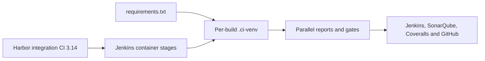

# Container diagram

```mermaid
flowchart LR
    Harbor["Harbor integration CI 3.14"] --> Jenkins["Jenkins container stages"]
    Requirements["requirements.txt"] --> Venv["Per-build .ci-venv"]
    Jenkins --> Venv
    Venv --> Reports["Parallel reports and gates"]
    Reports --> Outputs["Jenkins, SonarQube, Coveralls and GitHub"]
```
