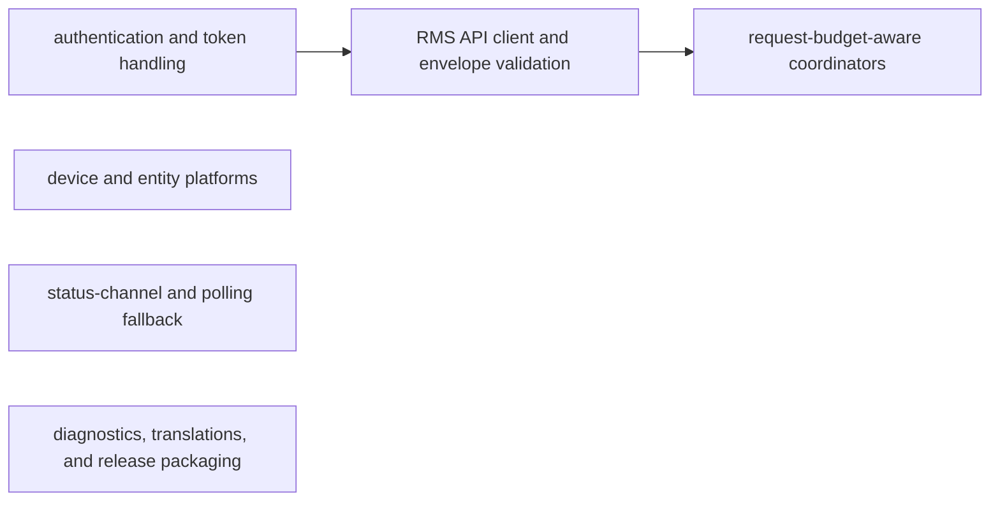

# Container diagram

```mermaid
flowchart LR
    Component1["authentication and token handling"]
    Component2["RMS API client and envelope validation"]
    Component3["request-budget-aware coordinators"]
    Component4["device and entity platforms"]
    Component5["status-channel and polling fallback"]
    Component6["diagnostics, translations, and release packaging"]
    Component1 --> Component2
    Component2 --> Component3
```
