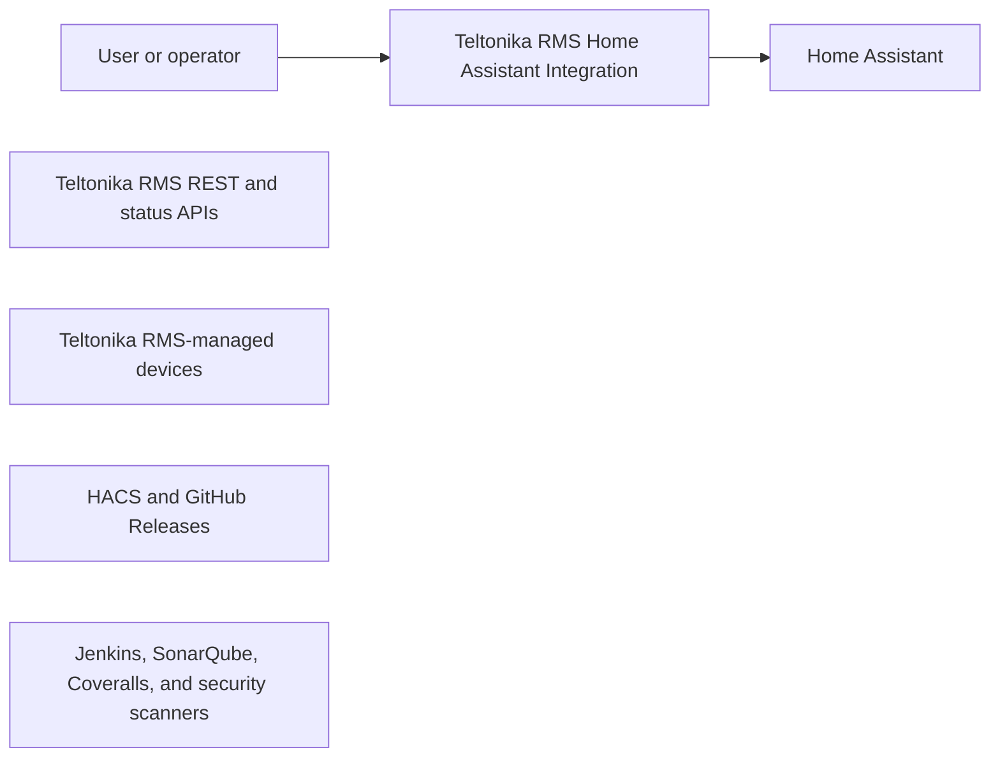

# System context diagram

```mermaid
flowchart LR
    User["User or operator"] --> Project["Teltonika RMS Home Assistant Integration"]
    External1["Home Assistant"]
    External2["Teltonika RMS REST and status APIs"]
    External3["Teltonika RMS-managed devices"]
    External4["HACS and GitHub Releases"]
    External5["Jenkins, SonarQube, Coveralls, and security scanners"]
    Project --> External1
```
